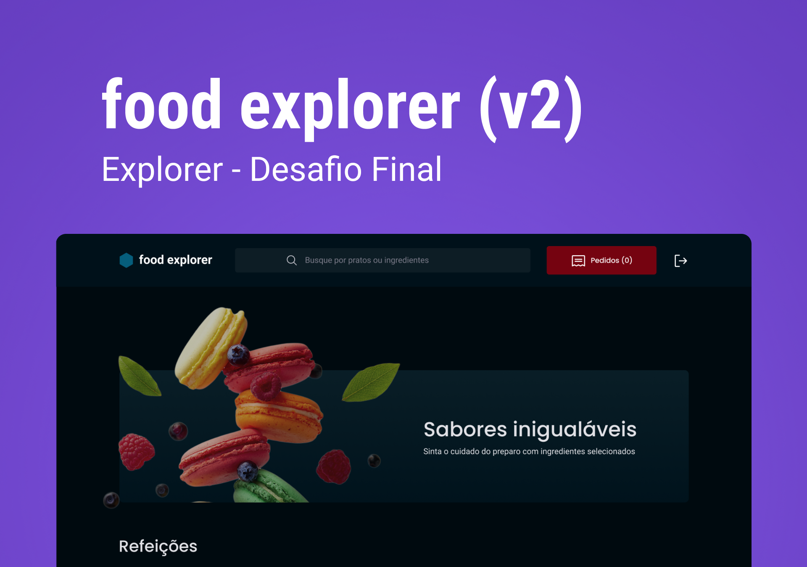

## Food Explorer

### Description:

The Food Explorer project consists of an e-commerce application that allows users to buy dishes from restaurants online. In addition, the project has an administrator account, which allows you to manipulate the products on the site, adding or modifying added dishes.

The front-end of the project (this repository) was developed in ReactJS and Styled Components, creating a beautiful interface for the user.s

### Preview:

<p align="center">
  
</p>

### Tech stack:

- [React JS](https://react.dev)
- [Node.js](https://nodejs.org/en)
- [Git/GitHub](https://git-scm.com)

### Usage:

You can clone this project and install the dependencies with the following command:

```sh
git https://github.com/EduVieira131/FoodExplorer-Front-end.git
cd FoodExplorer-Front-end
npm install
npm run dev
```

> **Note**
> To test the functionality of the project, create your account or use an already created test account for testing purposes:
>
> - Email: admin@admin.com </br>
> - Password: 123456
